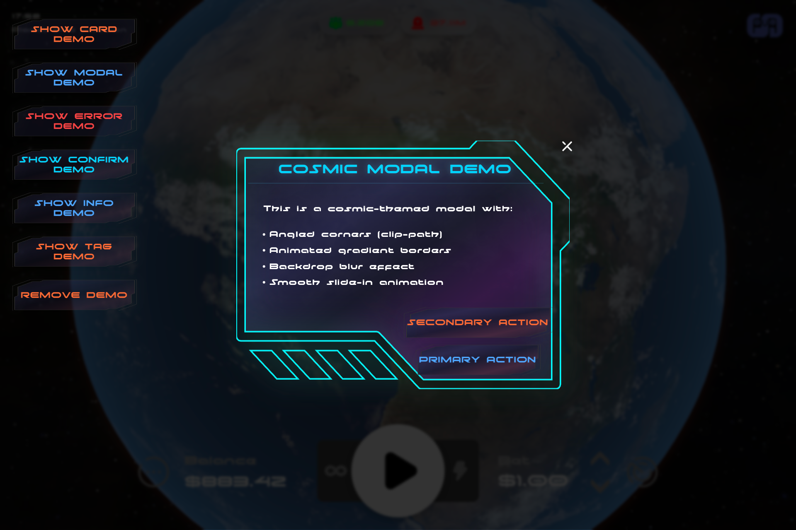
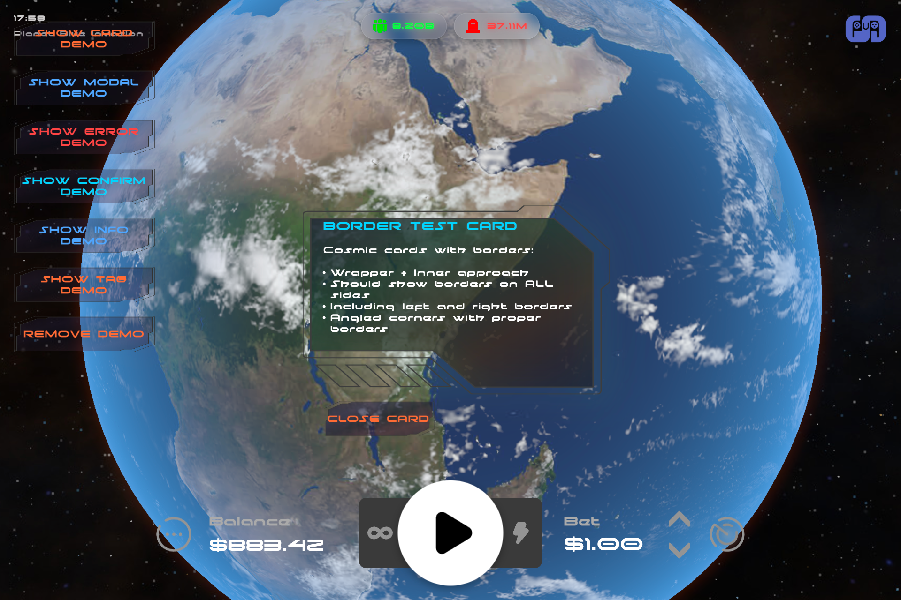
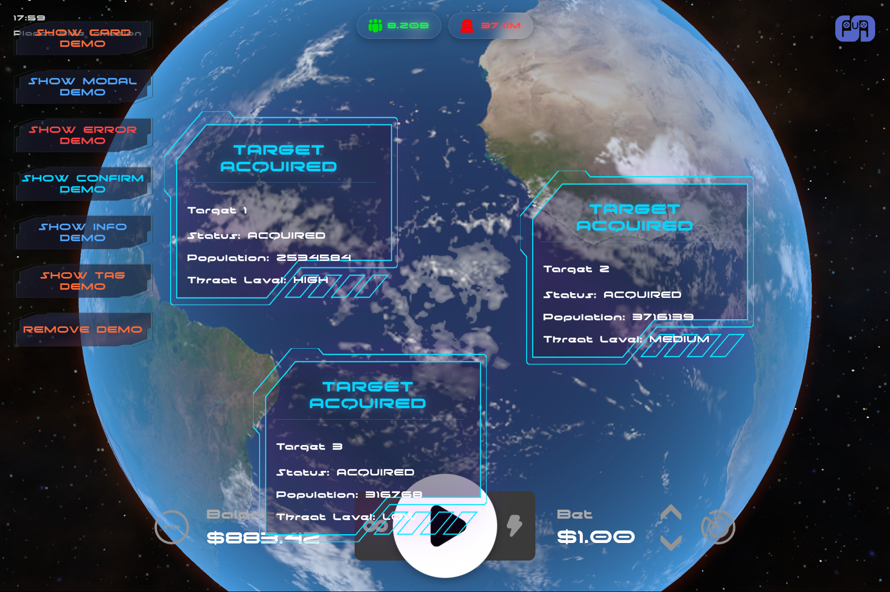

# Cosmic UI Lite

A lightweight, futuristic, space-themed UI component library built with TypeScript and vanilla JavaScript. Features SVG-based components with animated gradients, cosmic effects, and responsive design.

> 📸 **See the [Visual Showcase](#-visual-showcase) below for component screenshots and examples!**

## 🚀 Motivation

I needed a cosmic/sci-fi style UI for my game project, and I found [cosmic-ui](https://github.com/rizkimuhammada/cosmic-ui) pretty cool, but it requires React and my game is built with vanilla TypeScript. I didn't need most of the features there, so I decided to create this lightweight alternative that:

- **Zero Framework Dependencies** - Works with vanilla JavaScript/TypeScript
- **Lightweight & Focused** - Only the essential cosmic UI components
- **Game-Ready** - Optimized for interactive applications and games
- **Self-Contained** - Single CSS file + TypeScript class, no build process required

## 🚀 Features

- **Zero Dependencies**: Pure TypeScript/JavaScript with no external dependencies
- **SVG-Based**: Scalable vector graphics for crisp rendering at any size
- **Animated Effects**: Pulsing borders, particle animations, and gradient flows
- **Responsive Design**: Adapts to different screen sizes with media queries
- **TypeScript Support**: Full type safety with comprehensive interfaces
- **Modular Architecture**: Individual components with shared utilities
- **Cosmic Theme**: Futuristic space-inspired visual design

## ⚠️ Constraints & Limitations

While Cosmic UI Lite is designed for simplicity and game-ready performance, there are some design trade-offs to be aware of:

### SVG Border Scaling
The SVG borders are scaled as a single piece, which means on components with unusual aspect ratios (especially tall/narrow or wide/short), the borders may appear over-scaled or distorted. This is similar to how image scaling works without nine-slice functionality.

**Technical Note**: This could be solved by implementing a nine-slice system (similar to Unity's NineSlicedSprite or Pixi.js nine-slice textures) that scales corners, edges, and center independently. However, this would significantly increase complexity and goes against the project's goal of remaining lightweight and simple.

**Recommendation**: For best visual results, use components within reasonable aspect ratios. The default sizing and responsive breakpoints are optimized for typical UI use cases.

## 📦 Components

### Core Components

- **Button** - Animated buttons with multiple variants
- **Modal** - Full-featured modals with backdrop and animations
- **Card** - Content cards with cosmic borders
- **Info** - Overlay popups with customizable titles
- **Tag** - Location tags with flip animations
- **Notification** - Toast-style notifications
- **Error** - Error dialogs with confirmation
- **Confirmation** - Confirmation dialogs with callbacks

## 📸 Visual Showcase

### Component Gallery

**Cosmic Modal**


**Cosmic Info Popup**


**Cosmic Card**


**Cosmic Tag**


## 🎨 Visual Design

The components feature:
- **Angled corners** using SVG clip paths
- **Animated gradient borders** with color transitions
- **Particle flash effects** with dynamic backgrounds
- **Cosmic color scheme** with blues, cyans, and accent colors
- **Responsive scaling** for different screen sizes
- **Hover animations** with transform and glow effects

## 🖼️ Credits

**Inspiration**: [cosmic-ui](https://github.com/rizkimuhammada/cosmic-ui) by rizkimuhammada - original React-based cosmic UI library

**SVG Graphics**: "HUD futuristic frame" - luqman firdau @ [Vecteezy.com](https://www.vecteezy.com)

## 📁 File Structure

```
cosmic-ui-lite/
├── README.md               # This file
├── package.json           # Package configuration
├── rollup.config.js       # Build configuration
├── src/                   # Source code
│   ├── index.ts           # Main entry point
│   ├── components/        # Individual component classes
│   │   ├── CosmicButton.ts
│   │   ├── CosmicModal.ts
│   │   ├── CosmicCard.ts
│   │   ├── CosmicInfo.ts
│   │   └── CosmicTag.ts
│   ├── utils/             # Shared utilities
│   │   ├── svg.ts         # SVG creation helpers
│   │   └── gradients.ts   # Gradient definitions
│   ├── types/             # TypeScript definitions
│   │   └── index.ts
│   ├── styles/            # CSS and styling
│   │   └── cosmic-ui.css
│   └── demo/              # Demo system
│       └── index.ts
├── dist/                  # Built output (generated)
│   ├── index.esm.js       # ES Module build
│   ├── index.cjs.js       # CommonJS build
│   ├── index.umd.js       # UMD build
│   ├── index.d.ts         # TypeScript declarations
│   └── cosmic-ui.css      # Processed styles
└── screenshots/           # Component screenshots
    ├── screenshot-cosmic-modal.png
    ├── screenshot-cosmic-info.png
    ├── screenshot-cosmic-card.png
    └── screenshot-cosmic-tag.png
```

## 🚀 Quick Start

### 1. Build the Library

```bash
npm run build
```

This generates multiple output formats in the `dist/` directory.

### 2. Import the Library

```typescript
// Using ES modules (recommended)
import { CosmicUI } from './dist/index.esm.js';

// Using CommonJS
const { CosmicUI } = require('./dist/index.cjs.js');

// Using UMD (browser)
// Include <script src="./dist/index.umd.js"></script> in HTML
// Then use: const { CosmicUI } = window.CosmicUILite;
```

### 3. Include the CSS

```html
<link rel="stylesheet" href="./dist/cosmic-ui.css">
```

### 4. Create Components

```typescript
// Create a button
const button = CosmicUI.createButton({
  text: 'Launch Sequence',
  variant: 'primary',
  onClick: () => console.log('Button clicked!')
});

// Create a modal
const modal = CosmicUI.createModal({
  title: 'Mission Control',
  content: 'Ready for deployment?',
  buttons: [
    { text: 'Cancel', variant: 'secondary' },
    { text: 'Deploy', variant: 'primary', onClick: () => deploy() }
  ]
});

// Show the modal
CosmicUI.showModal(modal);
```

## 📖 Component Documentation

### CosmicButton

Creates animated buttons with cosmic styling.

```typescript
interface CosmicButtonOptions {
  text: string;                                    // Button text
  variant?: 'default' | 'primary' | 'secondary' | 'danger'; // Visual style
  onClick?: () => void;                           // Click handler
  disabled?: boolean;                             // Disabled state
  className?: string;                             // Additional CSS classes
}

const button = CosmicUI.createButton({
  text: 'Fire Laser',
  variant: 'danger',
  onClick: () => fireLaser()
});
```

**Variants:**
- `default` - Standard cosmic blue theme
- `primary` - Enhanced blue with stronger effects
- `secondary` - Orange accent theme
- `danger` - Red warning theme

### CosmicModal

Full-featured modals with backdrop blur and animations.

```typescript
interface CosmicModalOptions {
  title: string;                                  // Modal title
  content: string | HTMLElement;                  // Modal body content
  showCloseButton?: boolean;                      // Show X button
  buttons: CosmicButtonOptions[];                 // Footer buttons (required)
  onClose?: () => void;                          // Close callback
  className?: string;                             // Additional CSS classes
}

const modal = CosmicUI.createModal({
  title: 'Orbital Strike',
  content: 'Select target coordinates',
  buttons: [
    { text: 'Cancel', variant: 'secondary' },
    { text: 'Fire', variant: 'danger', onClick: () => fire() }
  ],
  onClose: () => console.log('Modal closed')
});
```

### CosmicCard

Content cards with animated borders.

```typescript
interface CosmicCardOptions {
  title?: string;                                 // Optional card title
  content: string | HTMLElement;                  // Card content
  className?: string;                             // Additional CSS classes
}

const card = CosmicUI.createCard({
  title: 'Ship Status',
  content: '<p>All systems operational</p>'
});
```

### CosmicInfo

Overlay information popups with customizable styling.

```typescript
interface CosmicInfoOptions {
  title?: string;                                 // Optional title
  titleColor?: 'yellow' | 'green' | 'blue' | 'purple' | 'golden-red'; // Title theme
  content: string | HTMLElement;                  // Info content
  className?: string;                             // Additional CSS classes
  onClose?: () => void;                          // Close callback
  showOverlay?: boolean;                         // Show backdrop overlay
}

const info = CosmicUI.createInfo({
  title: 'Mission Briefing',
  titleColor: 'golden-red',
  content: '<p>Target acquired. Proceed with caution.</p>',
  showOverlay: true
});
```

**Title Colors:**
- `yellow` - Golden yellow gradient with shimmer
- `green` - Bright green sci-fi theme
- `blue` - Electric blue cyberpunk theme
- `purple` - Mystic purple gradient
- `golden-red` - Fiery golden-red blend

### CosmicTag

Location tags with flip animations and auto-dismiss.

```typescript
interface CosmicTagOptions {
  title?: string;                                 // Optional tag title
  content: string | HTMLElement;                  // Tag content
  className?: string;                             // Additional CSS classes
  flipped?: boolean;                             // Horizontal flip
}

const tag = CosmicUI.createTag({
  title: 'TARGET ACQUIRED',
  content: '<div><h4>New York</h4><p>Population: 8.4M</p></div>',
  flipped: false
});
```

### Utility Methods

```typescript
// Show modal with backdrop
CosmicUI.showModal(modal);

// Show error dialog
CosmicUI.showError('System Failure', 'Unable to connect to mothership');

// Show confirmation dialog
CosmicUI.showConfirmation(
  'Destroy Planet',
  'Are you sure? This cannot be undone.',
  () => destroyPlanet(),
  () => console.log('Cancelled')
);

// Show notification toast
CosmicUI.showNotification('Success', 'Target eliminated');
```

## 🎭 Demo System

Use the demo system to test all components:

```typescript
import { createCosmicDemo } from './dist/index.esm.js';

// Add demo panel to page
createCosmicDemo();
```

Or build and run the demo:

```bash
npm run demo
```

This creates a floating demo panel with buttons to test:
- Card Demo - Shows content cards with borders
- Modal Demo - Interactive modal with buttons  
- Error Demo - Error dialog with alien theme
- Confirm Demo - Confirmation with callbacks
- Info Demo - Information popup with overlay
- Tag Demo - Multiple location tags with animations

## 🎨 Customization

### CSS Variables

The components use CSS custom properties for easy theming:

```css
:root {
  --cosmic-primary: #00d4ff;      /* Primary blue */
  --cosmic-secondary: #ff6b35;    /* Orange accent */
  --cosmic-danger: #ff4444;       /* Red warning */
  --cosmic-background: #000;      /* Background */
  --cosmic-text: #ffffff;         /* Text color */
}
```

### Animation Timing

Customize animation speeds:

```css
.cosmic-border {
  animation-duration: 2s; /* Slower pulse */
}

.cosmic-btn-wrapper:hover {
  transition: all 0.5s ease; /* Slower transitions */
}
```

### Responsive Breakpoints

Components automatically adapt to screen sizes:

- **Desktop**: Full size and effects
- **Tablet**: Scaled components (580px height)
- **Mobile**: Compressed layout (480px height)  
- **Small**: Ultra-compact mode (430px height)

## 🔧 Architecture

### Component Structure

Each component follows a consistent pattern:

1. **Wrapper Element** - Container with positioning
2. **SVG Background** - Animated gradient fill
3. **SVG Border** - Animated outline with effects
4. **Content Layer** - Text and interactive elements

### SVG System

Components use shared SVG utilities:

```typescript
// Shared path definitions
private static readonly PATHS = {
  MODAL_BACKGROUND: 'M 265.95318,319.32816 H 448.53221...',
  MODAL_BORDER: 'M 265.95318,319.32816 H 448.53221...',
  // ...
};

// Reusable creation methods
private static createSvgElement(className: string, viewBox: string): SVGElement;
private static createGradient(id: string, stops: GradientStop[]): SVGLinearGradientElement;
private static createPath(d: string, fill?: string): SVGPathElement;
```

### Animation System

Three animation layers:

1. **Particle Flash** - Moving gradient backgrounds
2. **Cosmic Pulse** - Border color cycling  
3. **Hover Effects** - Transform and glow changes

## 🌟 Examples

### Basic Button

```typescript
const launchButton = CosmicUI.createButton({
  text: 'Initialize Launch Sequence',
  variant: 'primary',
  onClick: () => {
    console.log('Launch sequence initiated');
    // Your launch logic here
  }
});

document.body.appendChild(launchButton);
```

### Interactive Modal

```typescript
const confirmModal = CosmicUI.createModal({
  title: 'Mission Critical Decision',
  content: `
    <p>You are about to commence orbital bombardment.</p>
    <ul>
      <li>Target: Earth Sector 7</li>
      <li>Payload: Antimatter Missiles</li>
      <li>Estimated Casualties: 2.4 Million</li>
    </ul>
    <p><strong>This action cannot be undone.</strong></p>
  `,
  buttons: [
    {
      text: 'Abort Mission', 
      variant: 'secondary',
      onClick: () => CosmicUI.showNotification('Aborted', 'Mission cancelled by operator')
    },
    {
      text: 'FIRE', 
      variant: 'danger',
      onClick: () => {
        CosmicUI.showNotification('Launched', 'Orbital strike in progress...');
        // Launch your orbital strike logic
      }
    }
  ]
});

CosmicUI.showModal(confirmModal);
```

### Dynamic Info Cards

```typescript
const locations = [
  { name: 'Tokyo', pop: '13.9M', threat: 'HIGH' },
  { name: 'London', pop: '9.5M', threat: 'MEDIUM' },
  { name: 'Sydney', pop: '5.3M', threat: 'LOW' }
];

locations.forEach((loc, index) => {
  const tag = CosmicUI.createTag({
    title: 'TARGET ACQUIRED',
    content: `
      <div style="padding: 15px;">
        <h3>${loc.name}</h3>
        <p><strong>Population:</strong> ${loc.pop}</p>
        <p><strong>Threat Level:</strong> ${loc.threat}</p>
        <p><strong>Status:</strong> LOCKED</p>
      </div>
    `,
    flipped: index % 2 === 0
  });
  
  // Position randomly on screen
  tag.style.position = 'fixed';
  tag.style.top = `${20 + index * 150}px`;
  tag.style.left = `${100 + index * 200}px`;
  tag.style.zIndex = '1000';
  
  document.body.appendChild(tag);
});
```

## 🚀 Getting Started for Development

1. **Clone the repository** or download the source code
2. **Install dependencies**: `npm install`
3. **Build the library**: `npm run build`
4. **Import components**: Use the built files in `dist/`
5. **Start creating components** using the documented interfaces

### Development Commands

- `npm run build` - Build all output formats
- `npm run build:watch` - Watch mode for development
- `npm run dev` - Alias for build:watch
- `npm run demo` - Build and run demo system
- `npm run clean` - Clean dist directory

## 📝 TypeScript Support

Full TypeScript support with exported interfaces:

```typescript
import { 
  CosmicUI,
  CosmicButtonOptions,
  CosmicModalOptions,
  CosmicCardOptions,
  CosmicInfoOptions,
  CosmicTagOptions
} from './dist/index.esm.js';
```

TypeScript declarations are automatically generated and included in `dist/index.d.ts`.

## 🔄 Version History

- **v1.0.0** - Initial release with core components
  - Button, Modal, Card, Info, Tag components
  - SVG-based rendering system
  - Responsive design support
  - Demo system included

## 📄 License

MIT License - Feel free to use in your projects!

## 🤝 Contributing

Contributions welcome! Please maintain the cosmic theme and follow the established patterns for new components.

---

*Built for the future. Designed for space. 🚀*